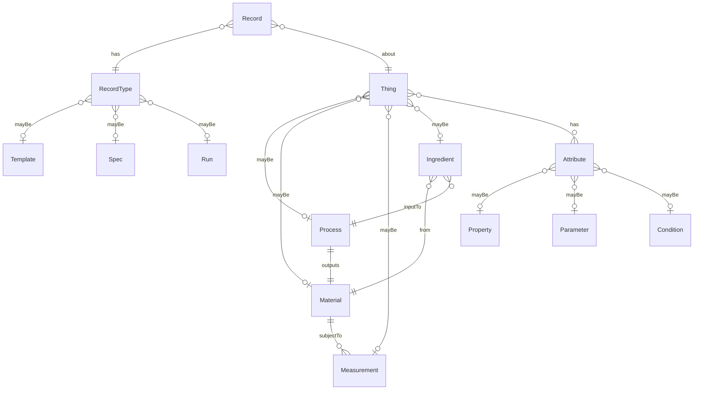

# model-memo

The things of concern[^1] are materials, processes, measurements, and ingredients.
Materials are output by processes and are subject to measurements.
A process may take materials as ingredients.

Things are recorded in three ways: as templates, as specs, and as runs.
You can record a template for a thing -- what might be the case.
You can also record a spec for a thing -- what is intended.
Finally, you can record a run for a thing -- what is, or was.

Each thing can have attributes from three categories: properties, parameters, and conditions.
A property is something measured or calculated.
A parameter is something set.
A condition describes an aspect of the thing's environment.

# model-diagram



# model-formalism

```json
[
  {
    "@base": "terminusdb:///data/",
    "@schema": "terminusdb:///schema#",
    "@type": "@context"
  },
  {
    "@id": "Thing",
    "@type": "Class",  
    "@abstract": [],
    "has": {
      "@type": "Set",
      "@class": "Attribute"
    }
  },
  {
    "@id": "Process",
    "@type": "Class",  
    "@inherits": ["Thing"],
    "outputs": "Material",
    "hasInput": {
        "@type": "Set",
        "@class": "Ingredient"
    }  
  },
  {
    "@id": "Material",
    "@type": "Class",  
    "@inherits": ["Thing"],
    "subjectTo": {
        "@type": "Set",
        "@class":  "Measurement"
    }
  },
  {
    "@id": "Measurement",
    "@type": "Class",  
    "@inherits": ["Thing"]
  },    
  {
    "@id": "Ingredient",
    "@type": "Class",  
    "@inherits": ["Thing"],
    "from": "Material"  
  },
  {
    "@id": "Attribute",
    "@type": "Class",  
    "@abstract": []
  },
  {
    "@id": "Property",
    "@type": "Class",  
    "@inherits": ["Attribute"]
  }, 
  {
    "@id": "Parameter",
    "@type": "Class",  
    "@inherits": ["Attribute"]
  }, 
  {
    "@id": "Condition",
    "@type": "Class",  
    "@inherits": ["Attribute"]
  },     
  {
    "@id": "Record",
    "@type": "Class",
    "@abstract": [],
    "about": "Thing"  
  },
  {
    "@id": "Template",
    "@type": "Class",
    "@inherits": ["Record"] 
  },
  {
    "@id": "Spec",
    "@type": "Class",
    "@inherits": ["Record"]
  },
  {
    "@id": "Run",
    "@type": "Class",
    "@inherits": ["Record"]
  }        
]
```

[^1]: https://citrineinformatics.github.io/gemd-docs/